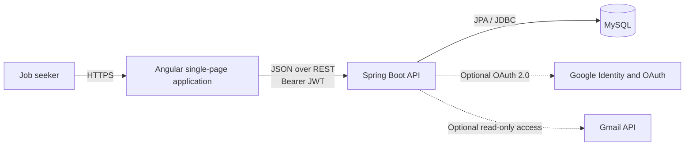
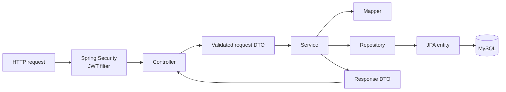
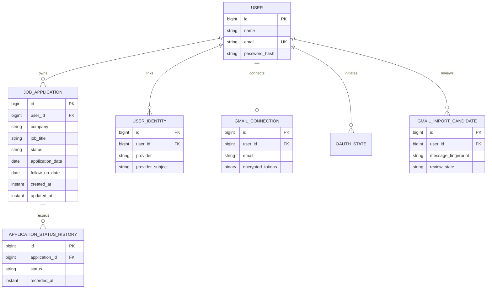
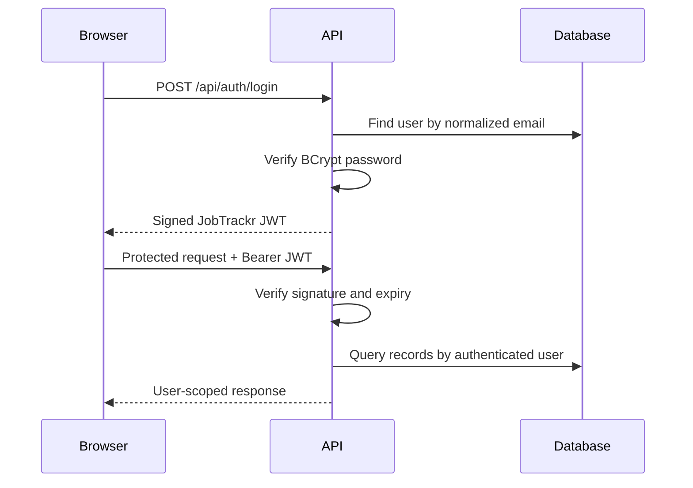

# JobTrackr Architecture

This document describes the V1 architecture of JobTrackr. It focuses on the
boundaries, data flows, and security decisions that are most important when
maintaining or deploying the application.

## System Context



The Angular application owns presentation and browser-side navigation. The
Spring Boot API owns authentication, authorization, validation, business rules,
and persistence. MySQL is the system of record.

Google integrations are optional. When their environment variables are absent,
password authentication and all manual job-tracking features continue to work.
The public V1 deployment enables basic Google Sign-In through a dedicated
production client ID. Restricted-scope Gmail import remains self-hosted and is
disabled automatically when its backend credentials are absent.

## Repository Layout

```text
JobTrackr/
|-- Backend/jobtrackr/       Spring Boot API and Maven build
|-- Frontend/                Angular application and Vitest tests
|-- Docs/                    Architecture, deployment, and integration guides
|-- .github/workflows/       GitHub Actions continuous integration
|-- compose.yaml             Local container topology
|-- render.yaml              Render infrastructure blueprint
`-- README.md                Project overview and quick start
```

## Backend Architecture

The backend uses a layered controller-service-repository design:



### Controllers

Controllers define the REST contract, bind and validate request DTOs, obtain the
authenticated user, and delegate business rules to services. The main API areas
are:

- authentication and connected identities;
- job application management;
- dashboard summaries;
- analytics, company insights, and follow-up queues;
- Gmail connection, scanning, review, import, and disconnection.

Controllers do not expose JPA entities directly.

### Services

Services implement use cases and transaction boundaries. They enforce ownership,
perform mapping, coordinate repositories, and integrate with Google when those
features are configured.

The service layer always derives the current user from the authenticated
principal. A client-supplied user ID is never trusted as an authorization
boundary.

### Repositories

Spring Data JPA repositories handle persistence. Queries involving user-owned
records include the owning user or user ID in their lookup criteria. This is the
primary data-isolation rule: knowing another record's numeric ID is not
sufficient to access it.

### Entities and migrations

The V1 data model includes:



Flyway migrations under `Backend/jobtrackr/src/main/resources/db/migration`
create and evolve the schema. Hibernate uses `ddl-auto=validate`; it validates
the migrated schema instead of modifying it at runtime.

All persisted and serialized timestamps use UTC. The frontend is responsible for
presenting them appropriately to the user.

### DTOs and validation

Request and response DTOs keep the external API independent from persistence
details. Bean Validation rejects missing or malformed fields before service
execution. Application validation covers required text, lengths, URLs, dates,
salary ranges, currency, enums, and related cross-field rules.

### Error handling

A centralized exception handler converts expected failures into consistent API
errors. Production responses do not include stack traces or internal exception
details. Authentication failures return `401`; authorization-safe missing
resource behavior prevents leaking whether another user's record exists.

## Frontend Architecture

The Angular application is organized by responsibility:

```text
src/app/
|-- core/       Authentication, route guards, HTTP services, and interceptors
|-- features/   Login, applications, dashboard, analytics, companies,
|               follow-ups, imports, and settings
|-- layout/     Authenticated application shell and navigation
|-- models/     TypeScript request and response contracts
`-- shared/     Reusable controls and presentation components
```

Routes are lazy-loaded. Guest guards protect login and registration from
authenticated users, while the authentication guard protects the application
workspace. The HTTP integration layer attaches the JobTrackr JWT to protected
requests and translates API failures into user-facing states.

The frontend uses server-side searching, filtering, sorting, and pagination
rather than loading every application into the browser.

## Authentication and Authorization

### Password flow



Passwords are hashed with BCrypt. The API is stateless and uses signed JWT access
tokens. JWT secrets are environment-specific and must never be committed.

### Google Sign-In

Google Sign-In is optional. The browser receives only the public OAuth client ID.
The backend verifies the Google credential's signature, issuer, audience,
expiry, subject, and verified email before issuing a normal JobTrackr JWT.

An existing password account is not automatically linked merely because the
email addresses match. The authenticated user must link the external identity
from account settings.

### Gmail connection and import

Gmail uses a separate server-side OAuth authorization-code flow:

1. The authenticated user starts a Gmail connection.
2. The backend creates a short-lived, single-use OAuth state and stores only its
   SHA-256 hash.
3. Google redirects to the fixed backend callback.
4. The backend exchanges the code and verifies that the Gmail address matches
   the authenticated JobTrackr account.
5. Access and refresh tokens are encrypted with AES-256-GCM and bound to the
   owning user.
6. A user-initiated scan reads a bounded number of recent matching messages.
7. Parsed suggestions enter a private review queue.
8. No application is created until the user validates and approves it.

Raw Gmail message bodies and raw message IDs are not stored. User-bound
fingerprints provide deduplication.

## Analytics

Application status history supports stage-funnel and conversion analytics even
after an application advances to a later status. Dashboard, analytics, company,
and follow-up queries are all scoped to the authenticated user.

Follow-up categories are calculated from application status, follow-up dates,
and last-updated timestamps. They are derived views rather than separate
user-owned records.

## Operational Architecture

- Spring Boot is stateless and can be restarted without losing application data.
- MySQL requires persistent storage and backups.
- Flyway runs schema migrations during backend startup.
- `/api/health` is the application health endpoint.
- CORS accepts only explicitly configured frontend origins.
- External credentials and encryption keys are supplied through environment
  variables.
- Multi-stage builds keep Maven, the JDK, Node.js, and source files out of the
  runtime images.
- The backend runs as a non-root Linux user; Nginx serves the optimized Angular
  artifact and proxies `/api` only inside the local Compose network.
- Docker Compose waits for MySQL and backend health before starting dependent
  services and persists database files in a named volume.
- Render runs the Angular artifact as a static site and Spring Boot as a
  Docker-based web service. The hosted demo connects over TLS to an external
  Aiven free MySQL service; local Docker Compose keeps MySQL on its private
  container network.
- GitHub Actions builds and tests both applications on pull requests and pushes
  to `main`, validates Compose, and builds both production images.

The planned V1 deployment topology and operational checklist are documented in
[DEPLOYMENT.md](DEPLOYMENT.md).

## Key Decisions and Trade-offs

| Decision                                        | Reason                                                           | Trade-off                                                                                    |
| ----------------------------------------------- | ---------------------------------------------------------------- | -------------------------------------------------------------------------------------------- |
| Spring Boot layered architecture                | Clear ownership and testable business logic                      | More mapping code than exposing entities directly                                            |
| MySQL with Flyway                               | Matches the project stack and provides repeatable schema changes | Requires managed backups and persistent hosting                                              |
| Stateless JWT authentication                    | Simple SPA/API deployment                                        | V1 stores the token in browser storage; secure refresh cookies are a future hardening option |
| User-scoped repository queries                  | Prevents cross-account record access                             | Every new query must preserve the ownership constraint                                       |
| Review-before-import Gmail flow                 | Keeps users in control of inferred data                          | Adds a review step                                                                           |
| Separate Google Sign-In and Gmail configuration | Public identity can launch without restricted-scope verification | Gmail import remains self-hosted until verification is complete                              |
| Build-time frontend API configuration           | One Angular artifact pattern supports local and hosted backends  | A changed hosted API URL requires rebuilding the static site                                 |
| Aiven free MySQL for the hosted demo            | Preserves MySQL without a card or time-limited Render database   | Public TLS endpoint, 1 GB limit, single node, no SLA, and idle-service shutdown              |
| No direct Workday credentials or private API    | Avoids brittle automation and credential risk                    | Detection depends on application-related emails                                              |
