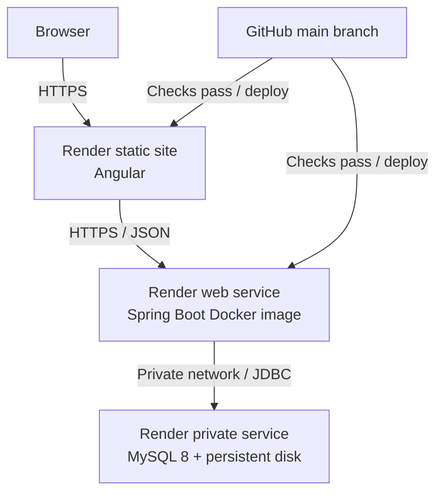

# JobTrackr Deployment Guide

This document defines the V1 deployment target for JobTrackr on Render.

> **Current status:** Render deployment is part of the final V1 phase. The
> Dockerfiles, Compose configuration, Render Blueprint, live URLs, and final
> production verification must be completed before this guide is marked
> operational.

## V1 Deployment Profile

The public V1 demo will support password registration, login, manual application
tracking, analytics, companies, and follow-ups. Google Sign-In and Gmail import
will not receive credentials in the public Render environment. They remain
optional self-hosted integrations documented in
[GOOGLE_INTEGRATION.md](GOOGLE_INTEGRATION.md).

The target topology is:



The database must not be publicly exposed. Render documents MySQL as a private
service with its persistent disk mounted at `/var/lib/mysql`. Persistent disks
are available on paid services, so this topology is cost-conscious but not
guaranteed to be free.

## Prerequisites

- A GitHub account with access to the JobTrackr repository
- A Render account connected to GitHub
- A clean, passing `main` branch
- Production Docker and frontend builds verified locally
- Secure production secrets generated before deployment
- A decision on the Render region; keep the backend and MySQL in the same region

Never commit production credentials, paste them into screenshots, or add them to
Docker build arguments.

## Required Production Configuration

### Backend variables

| Variable               | Required | Production value                                                   |
| ---------------------- | -------- | ------------------------------------------------------------------ |
| `DB_URL`               | Yes      | JDBC URL using the private MySQL hostname and port                 |
| `DB_USERNAME`          | Yes      | Dedicated non-root JobTrackr database user                         |
| `DB_PASSWORD`          | Yes      | Strong database password                                           |
| `DB_POOL_SIZE`         | No       | Start with `10`; tune only with evidence                           |
| `JWT_SECRET`           | Yes      | Random value containing at least 32 bytes of entropy               |
| `JWT_EXPIRATION_MS`    | No       | Defaults to `86400000`                                             |
| `CORS_ALLOWED_ORIGINS` | Yes      | Exact HTTPS frontend origin                                        |
| `PORT`                 | Render   | Render-provided service port; Phase 12 must bind Spring Boot to it |

The JDBC URL will follow this shape:

```text
jdbc:mysql://INTERNAL_MYSQL_HOST:3306/jobtrackr_db?serverTimezone=UTC
```

Use the actual internal hostname shown by Render. Do not use `localhost` from
the backend service.

### Google variables

Leave these unset in the public V1 deployment:

```text
GOOGLE_CLIENT_ID
GOOGLE_GMAIL_CLIENT_ID
GOOGLE_GMAIL_CLIENT_SECRET
GMAIL_TOKEN_ENCRYPTION_KEY
GOOGLE_GMAIL_REDIRECT_URI
GMAIL_FRONTEND_CALLBACK_URL
```

The application must present Google services as optional self-hosted features
when they are unconfigured. Public users must never be asked to enter OAuth
client secrets into the hosted frontend.

### Generate secrets in PowerShell

Generate a JWT secret:

```powershell
$jwtBytes = New-Object byte[] 48
$jwtRng = [Security.Cryptography.RandomNumberGenerator]::Create()
$jwtRng.GetBytes($jwtBytes)
$jwtRng.Dispose()
[Convert]::ToBase64String($jwtBytes)
```

Generate database passwords separately with a trusted password manager. Do not
reuse the JWT secret as a database password.

## Local Release Validation

The final release must pass the normal builds:

```powershell
cd Backend\jobtrackr
.\mvnw.cmd --batch-mode --no-transfer-progress verify

cd ..\..\Frontend
npm ci
npm test -- --watch=false
npm run build
```

Phase 12 will add Docker commands to this section after the Dockerfiles and
Compose file exist. At minimum, the validation must demonstrate:

- backend image build and startup;
- frontend image or static production artifact build;
- MySQL startup with persistent local volume;
- Flyway migrations from an empty database;
- frontend-to-backend requests;
- container restart without data loss.

## Render Deployment Sequence

### 1. Deploy MySQL

Create a MySQL 8 private service based on Render's supported MySQL deployment
pattern.

Set:

```text
MYSQL_DATABASE=jobtrackr_db
MYSQL_USER=jobtrackr
MYSQL_PASSWORD=<generated secret>
MYSQL_ROOT_PASSWORD=<different generated secret>
```

Attach a persistent disk:

```text
Mount path: /var/lib/mysql
```

Only the backend should connect to the database over Render's private network.
Use `mysqldump` for database backups; a disk snapshot alone is not a
database-consistent backup strategy.

### 2. Deploy the backend

Create a Docker-based Render web service from the repository. Phase 12 will add
the exact monorepo Dockerfile path to this guide.

Configure:

- the backend environment variables listed above;
- the backend's region to match MySQL;
- `/api/health` as the HTTP health-check path;
- automatic deployment only after required GitHub checks pass, where supported;
- no Google environment variables for the public V1 demo.

The deployed backend must return a successful response from:

```text
https://BACKEND_HOST/api/health
```

### 3. Deploy the frontend

Create a Render static site with:

```text
Root directory: Frontend
Build command: npm ci && npm run build
Publish directory: dist/jobtrackr/browser
```

The production Angular build must use the deployed backend URL. The current
development configuration uses `/api`; Phase 12 must add the final production
configuration before deployment.

Add a rewrite for Angular client-side routes:

```text
Source: /*
Destination: /index.html
Action: Rewrite
```

### 4. Finalize CORS

Set `CORS_ALLOWED_ORIGINS` on the backend to the exact frontend URL:

```text
https://FRONTEND_HOST
```

Do not use `*` with authenticated production endpoints.

### 5. Verify production

Complete the following checks using a new test account:

- register, log in, log out, and log back in;
- create, view, edit, and delete an application;
- verify search, filters, sorting, and pagination;
- change statuses and confirm status history;
- verify dashboard, analytics, companies, and follow-ups;
- confirm another account cannot access the first account's data;
- confirm invalid and unauthorized requests return safe errors;
- confirm Google features display the self-hosted explanation;
- confirm browser refresh works on every Angular route;
- confirm `/api/health` is healthy;
- restart services and verify database records remain;
- inspect browser and server logs for secrets or stack traces.

## Deployment Safety Checklist

Before making the live-demo link public:

- [ ] GitHub Actions passes on the release commit
- [ ] Backend and frontend production builds pass locally
- [ ] Docker Compose passes from a clean database
- [ ] No secret appears in Git history or tracked files
- [ ] MySQL uses a non-root application account
- [ ] MySQL is private and has persistent storage
- [ ] Database backup and restore commands are documented and tested
- [ ] `JWT_SECRET` is production-only and randomly generated
- [ ] CORS contains only the deployed frontend origin
- [ ] Google credentials are absent from the public V1 environment
- [ ] Health checks and service logs are clean
- [ ] Authentication and user-data isolation are manually verified
- [ ] README contains the correct live-demo URL and limitations
- [ ] A `v1.0.0` tag is created only after verification

## Rollback and Recovery

- Keep the previous successful Render deployment available for rollback.
- Do not rewrite or delete an existing Flyway migration after it has reached
  production; add a new forward migration.
- Back up MySQL using `mysqldump` before a migration with material data risk.
- Restore into a separate database first and validate it before replacing a
  production database.
- Rotate any secret immediately if it is exposed, then invalidate affected
  sessions or OAuth connections.

## Render References

- [Docker on Render](https://render.com/docs/docker)
- [Environment variables and secrets](https://render.com/docs/configure-environment-variables)
- [Deploy MySQL](https://render.com/docs/deploy-mysql)
- [Persistent disks](https://render.com/docs/disks)
- [Static-site redirects and rewrites](https://render.com/docs/redirects-rewrites)
- [Health checks](https://render.com/docs/health-checks)
- [Blueprint specification](https://render.com/docs/blueprint-spec)
