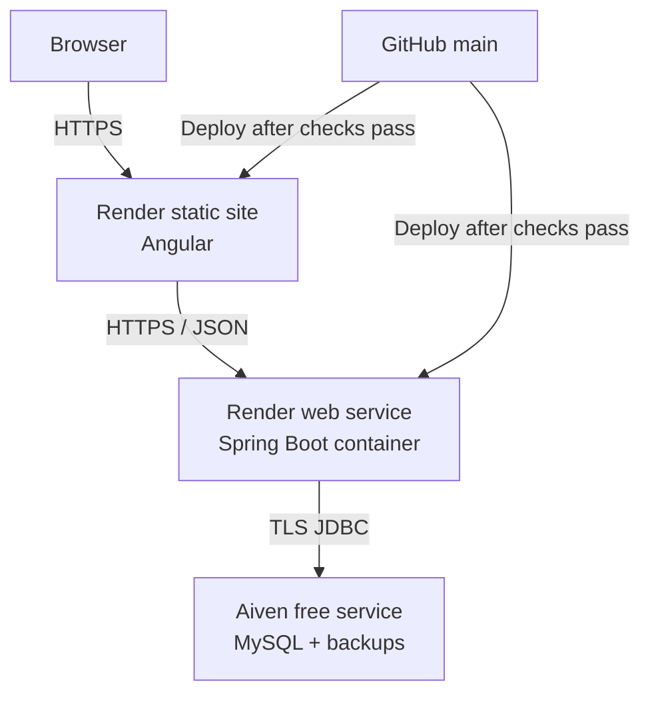

# JobTrackr Deployment Guide

This document defines the V1 container and Render deployment workflow.

> **Current status:** The backend and frontend images, Docker Compose stack,
> health checks, Flyway migrations, Nginx proxy, Angular route fallback, and
> MySQL persistence have been verified locally. `render.yaml` defines the
> hosted frontend and backend, but it has not been applied. The Blueprint
> defines no paid Render resource, and the external Aiven free MySQL plan
> requires no card.

## V1 Deployment Profile

The public V1 deployment supports:

- password registration and authentication;
- Google Sign-In through a JobTrackr-owned production client ID;
- manual application management;
- dashboard, analytics, companies, and follow-up workflows.

Gmail import remains an optional self-hosted feature because
`gmail.readonly` is a restricted Google scope. The public backend intentionally
omits Gmail client credentials and token-encryption keys. The frontend detects
this state and displays the self-hosted explanation.

The hosted topology is:



The local container topology uses Nginx at `http://localhost:4200`. Nginx
proxies `/api` to Spring Boot over an internal Docker network. MySQL is not
published to the host.

## Cost and Safety

Creating or editing the Dockerfiles and Blueprint costs nothing.

Applying `render.yaml` creates:

- a free static site;
- a free web-service instance for the API, subject to Render's current free-tier
  limits.

The database is created separately on Aiven's free MySQL plan. The plan requires
no card, has no fixed expiry, and currently includes 1 GB storage, 1 GB RAM, one
CPU, and backups. It is a single-node demo service without an SLA. Aiven can
power it off after sustained inactivity and sends notice before doing so.

Render free web services spin down after inactivity and can take about a minute
to wake. This topology is appropriate for a public portfolio demo, not a
high-availability production workload. Deleting local containers does not
affect Render or Aiven.

Never commit production credentials, paste them into screenshots, or use them
as Docker build arguments.

## Local Docker Workflow

### Prerequisites

- Docker Desktop using Linux containers
- Docker Compose v2
- a repository-root `.env` copied from `.env.example`

### Start the stack

```powershell
docker compose up --build
```

Services:

| Service    | Local access                       | Notes                                      |
| ---------- | ---------------------------------- | ------------------------------------------ |
| Frontend   | `http://localhost:4200`            | Nginx, Angular routing, and `/api` proxy   |
| Backend    | `http://localhost:8080`            | Direct API access for diagnostics          |
| MySQL      | Docker network only                | Non-root application user and named volume |
| API health | `http://localhost:8080/api/health` | Returns `{"status":"UP"}`                  |

Inspect health:

```powershell
docker compose ps
Invoke-RestMethod http://localhost:4200/api/health
```

Stop containers while preserving the database:

```powershell
docker compose down
```

Delete the local Docker database only when a clean environment is intentional:

```powershell
docker compose down --volumes
```

The `jobtrackr_mysql_data` volume is separate from MySQL installed directly on
Windows.

### Local verification baseline

The release stack has been verified for:

- clean backend and frontend image builds;
- non-root Spring Boot runtime;
- MySQL health before backend startup;
- backend health before frontend startup;
- all five Flyway migrations from an empty MySQL database;
- frontend-to-backend requests through Nginx;
- Angular deep-link refresh;
- database persistence after stopping and restarting all containers.

## Container Design

### Backend image

`Backend/jobtrackr/Dockerfile` uses a Maven/Java 21 build stage and a Java 21 JRE
runtime stage. The runtime image:

- contains only the packaged application and JRE;
- runs as the non-root `jobtrackr` user;
- limits JVM memory relative to the container;
- supports graceful Spring shutdown;
- binds to `PORT`, defaulting to `8080`;
- exposes `/api/health` through a Docker health check.

### Frontend image

`Frontend/Dockerfile` uses Node 22 to build Angular and Nginx to serve the
optimized artifact. Nginx:

- falls back to `index.html` for Angular routes;
- proxies `/api` to the backend container;
- applies basic response security headers;
- caches hashed assets and prevents caching of `config.js`;
- exposes its own health check.

`JOBTRACKR_API_URL` generates the public frontend configuration during the
build. It accepts only an HTTP(S) URL or a root-relative path. It is not a place
for secrets.

## Render Blueprint

The repository-root `render.yaml` defines:

| Service name              | Type                | Region |
| ------------------------- | ------------------- | ------ |
| `jobtrackr-neellogic`     | Angular static site | CDN    |
| `jobtrackr-api-neellogic` | Docker web service  | Ohio   |

The expected public URLs are:

```text
https://jobtrackr-neellogic.onrender.com
https://jobtrackr-api-neellogic.onrender.com
```

If Render requires different service names, update all affected values before
deployment:

- backend `CORS_ALLOWED_ORIGINS`;
- frontend `JOBTRACKR_API_URL`;
- Google authorized JavaScript origin.

The API and frontend deploy from `main` only after linked GitHub checks pass.
The API receives Aiven connection values as unsynced Render environment
variables. Flyway creates the JobTrackr schema when the API first connects.

## Required Production Configuration

### Backend

| Variable               | Source                                                        |
| ---------------------- | ------------------------------------------------------------- |
| `PORT`                 | Blueprint value `10000`                                       |
| `DB_URL`               | Aiven JDBC URL entered as an unsynced Render secret           |
| `DB_USERNAME`          | Aiven service username entered only in Render                 |
| `DB_PASSWORD`          | Aiven service password entered only in Render                 |
| `DB_POOL_SIZE`         | `5` for the small V1 service                                  |
| `JWT_SECRET`           | Render-generated random value                                 |
| `JWT_EXPIRATION_MS`    | `86400000`                                                    |
| `CORS_ALLOWED_ORIGINS` | Exact frontend HTTPS origin                                   |
| `GOOGLE_CLIENT_ID`     | Public production Google Sign-In client ID, entered in Render |

### Frontend

| Variable            | Value                                      |
| ------------------- | ------------------------------------------ |
| `NODE_VERSION`      | `22`                                       |
| `JOBTRACKR_API_URL` | Exact backend HTTPS URL followed by `/api` |

### Aiven MySQL

Create a free Aiven for MySQL service and copy its host, port, database,
username, and password from **Overview > Connection information**.

The Render `DB_URL` must require TLS:

```text
jdbc:mysql://AIVEN_HOST:AIVEN_PORT/defaultdb?sslmode=require&serverTimezone=UTC
```

Use the actual database name if it differs from `defaultdb`. Do not include the
username or password in the URL. Aiven connection values must never be committed
or placed in frontend configuration.

### Gmail variables

Do not set these in the public V1 environment:

```text
GOOGLE_GMAIL_CLIENT_ID
GOOGLE_GMAIL_CLIENT_SECRET
GMAIL_TOKEN_ENCRYPTION_KEY
GOOGLE_GMAIL_REDIRECT_URI
GMAIL_FRONTEND_CALLBACK_URL
```

## Deployment Sequence

### 1. Confirm the release branch

Before provisioning anything:

```powershell
git switch main
git pull --ff-only

cd Backend\jobtrackr
.\mvnw.cmd --batch-mode --no-transfer-progress verify

cd ..\..\Frontend
npm ci
npm run config:check
npm test -- --watch=false
npm run build

cd ..
docker compose config --quiet
docker compose build
```

### 2. Create the free Aiven MySQL service

1. Create an Aiven account without adding a payment method.
2. Select **Create service > MySQL > Free**.
3. Name the service `jobtrackr-mysql` and create it.
4. Wait until its status is **Running**.
5. Open **Quick connect** and record the host, port, database, username, and
   password in a password manager.
6. Build the TLS JDBC URL shown in the Aiven section above.

The free tier has no fixed expiry, but Aiven can power off an inactive service.
It can be powered on again from the Aiven Console.

### 3. Create the Render Blueprint

1. Sign in to Render and connect the `NeelLogic/JobTrackr` repository.
2. Select **New > Blueprint**.
3. Choose the repository and the root `render.yaml`.
4. Confirm the Ohio region for the API.
5. Supply the Aiven `DB_URL`, `DB_USERNAME`, and `DB_PASSWORD` when Render
   requests the unsynced values.
6. Supply `GOOGLE_CLIENT_ID`.
7. Confirm both Render services use the free plan and apply the Blueprint.

### 4. Verify service configuration

Confirm:

- the JDBC URL uses `sslmode=require`;
- Aiven credentials exist only in the API environment;
- the API health path is `/api/health`;
- the API has no Gmail environment variables;
- the frontend API URL matches the actual backend URL;
- CORS contains only the actual frontend origin;
- automatic deployment waits for GitHub checks.

### 5. Update Google Sign-In

In the production Google Cloud project, add the deployed frontend URL under
**Authorized JavaScript origins**:

```text
https://jobtrackr-neellogic.onrender.com
```

Use the actual Render URL if the service name changed. Google Sign-In uses only
the public browser client ID; do not add a client secret to Angular.

### 6. Verify production

Using fresh accounts:

- register, sign in, sign out, and sign back in;
- sign in with Google and link Google to an authenticated password account;
- create, view, edit, search, filter, sort, paginate, and delete applications;
- change statuses and verify history-dependent analytics;
- verify dashboard, analytics, companies, and follow-ups;
- confirm another account cannot access the first account's data;
- confirm invalid and unauthorized requests return safe errors;
- confirm Gmail displays the self-hosted explanation;
- refresh every Angular route directly;
- confirm `/api/health` is healthy;
- restart the API and verify database records remain;
- inspect browser and server logs for secrets or stack traces.

## Backup and Recovery

Use `mysqldump` for portable database-consistent backups in addition to Aiven's
included backups.

- Back up before any material schema or data migration.
- Restore into a separate database first and validate it.
- Never edit or remove a Flyway migration that has reached production.
- Keep the previous successful Render deployment available for rollback.
- Rotate exposed secrets immediately and invalidate affected sessions or OAuth
  connections.

## Release Checklist

- [ ] GitHub Actions passes on the release commit
- [ ] Backend tests and executable JAR build pass
- [ ] Frontend configuration tests, Angular tests, and build pass
- [ ] Both Docker images build
- [ ] Docker Compose starts from a clean database
- [ ] Flyway migrations complete
- [ ] Restart persistence test passes
- [ ] No secret appears in Git history or tracked files
- [ ] Aiven MySQL is running and the JDBC connection requires TLS
- [ ] Aiven credentials exist only in Render's backend environment
- [ ] Backup and restore procedure is verified
- [ ] JWT secret is generated only in Render
- [ ] CORS contains only the deployed frontend origin
- [ ] Production Google client has the exact frontend origin
- [ ] Gmail credentials are absent from the public environment
- [ ] README contains the final live-demo URL
- [ ] A `v1.0.0` tag is created only after final verification

## Official References

- [Docker on Render](https://render.com/docs/docker)
- [Render Blueprints](https://render.com/docs/blueprint-spec)
- [Environment variables and secrets](https://render.com/docs/configure-environment-variables)
- [Static sites](https://render.com/docs/static-sites)
- [Health checks](https://render.com/docs/health-checks)
- [Aiven free MySQL](https://aiven.io/docs/products/mysql/concepts/mysql-free-tier)
- [Connect Java to Aiven MySQL](https://aiven.io/docs/products/mysql/howto/connect-with-java)
