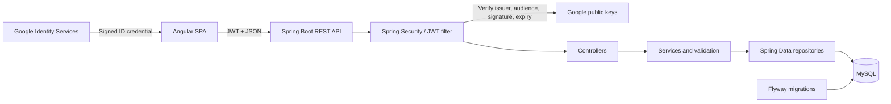

# JobTrackr

[](https://github.com/NeelLogic/JobTrackr/actions/workflows/ci.yml)

JobTrackr is a full-stack job application tracker for students and new graduates. It provides a secure, user-specific workspace for organizing opportunities, following application progress, and understanding job-search activity.

> **Project status:** Phase 7 is complete. JobTrackr now supports local credentials, Google Sign-In, and secure Google account linking. Gmail-based application import is planned for Phase 8; Docker and Render deployment remain part of the Phase 12 release work.

## Features

- Account registration and login with BCrypt password hashing and JWT authentication
- Google Sign-In for new or previously linked accounts
- Protected account settings for safely linking an existing password account to Google
- Protected Angular routes and authenticated API requests
- User-specific data isolation at the repository and service layers
- Complete job application create, read, update, and delete workflows
- Company, job title, location, job URL, dates, employment type, salary, notes, and follow-up tracking
- Saved, Applied, Assessment, Interview, Offer, Rejected, and Withdrawn statuses
- Search by company, job title, or location
- Status and employment-type filters
- Server-side sorting and pagination
- Dashboard totals, monthly activity, interview/offer/rejection counts, status distribution, and recent applications
- Responsive layouts, keyboard navigation, accessible form errors, and loading, empty, and error states

## Tech Stack

| Layer              | Technologies                                                                |
| ------------------ | --------------------------------------------------------------------------- |
| Frontend           | Angular 21, TypeScript 5.9, RxJS, SCSS                                      |
| Backend            | Java 21, Spring Boot 3.5, Spring Security, Spring Data JPA, Bean Validation |
| Database           | MySQL, Flyway migrations; H2 for automated tests                            |
| Authentication     | BCrypt, Google Identity Services, OAuth 2.0 ID-token verification, JWT      |
| Testing            | JUnit 5, Spring Boot Test, Spring Security Test, Vitest                     |
| Tooling            | Maven Wrapper, npm, Git, GitHub Actions                                     |
| Planned deployment | Docker and Render                                                           |

## Architecture



The backend uses a controller-service-repository structure with DTOs, entity mapping, validation, and centralized exception handling. All application queries are scoped to the authenticated user, including individual record lookups, updates, and deletion.

## Repository Structure

```text
JobTrackr/
|-- Backend/jobtrackr/       Spring Boot API, migrations, and tests
|-- Frontend/                Angular application and component tests
|-- .github/workflows/       Continuous integration
`-- README.md
```

## API Overview

| Method   | Endpoint                    | Purpose                                             |
| -------- | --------------------------- | --------------------------------------------------- |
| `POST`   | `/api/auth/register`        | Create a password account                           |
| `POST`   | `/api/auth/login`           | Authenticate with a password and receive a JWT      |
| `GET`    | `/api/auth/google/config`   | Retrieve the public Google client configuration     |
| `POST`   | `/api/auth/google`          | Authenticate with a verified Google ID credential   |
| `POST`   | `/api/auth/google/link`     | Link Google to the authenticated user's account     |
| `GET`    | `/api/auth/identities`      | List the authenticated user's connected identities  |
| `GET`    | `/api/applications`         | Search, filter, sort, and paginate applications     |
| `POST`   | `/api/applications`         | Create an application                               |
| `GET`    | `/api/applications/{id}`    | View an owned application                           |
| `PUT`    | `/api/applications/{id}`    | Update an owned application                         |
| `DELETE` | `/api/applications/{id}`    | Delete an owned application                         |
| `GET`    | `/api/dashboard`            | Retrieve user-specific analytics                    |
| `GET`    | `/api/health`               | Check API health                                    |

Registration, password login, Google login, Google configuration, and health checks are public. Account linking, connected identities, application data, and dashboard analytics require an `Authorization: Bearer <token>` header.

## Local Development

### Prerequisites

- Java 21 or newer
- Node.js 22 and npm 10
- MySQL 8

### 1. Start MySQL

Make sure MySQL is running and that the configured user can create or access `jobtrackr_db`. Flyway creates and validates the application tables automatically.

### 2. Run the backend

From PowerShell:

```powershell
cd Backend\jobtrackr

$env:DB_USERNAME = "root"
$env:DB_PASSWORD = "your-mysql-password"
$env:JWT_SECRET = "replace-with-a-random-secret-of-at-least-32-characters"
$env:GOOGLE_CLIENT_ID = "your-client-id.apps.googleusercontent.com"

.\mvnw.cmd spring-boot:run
```

The API runs at `http://localhost:8080`. Verify it with `http://localhost:8080/api/health`.

### 3. Run the frontend

In a second terminal:

```powershell
cd Frontend
npm ci
npm start
```

Open `http://localhost:4200`. The Angular development proxy forwards `/api` requests to the backend.

### Google Sign-In setup

Google Sign-In is disabled automatically when `GOOGLE_CLIENT_ID` is not configured, so local password authentication continues to work without Google.

To enable it:

1. Open Google Cloud Console and select or create a project.
2. In Google Auth Platform, configure the app for an external testing audience and add your Google account as a test user.
3. Create an OAuth client with application type **Web application**.
4. Add `http://localhost` and `http://localhost:4200` as authorized JavaScript origins.
5. Copy the public client ID into `GOOGLE_CLIENT_ID`, then restart the backend.

Phase 7 uses the Google Identity Services callback flow and does not require a redirect URI or client secret. Never add a Google client secret to the frontend or repository.

## Environment Variables

| Variable               | Required | Default                        | Description                                           |
| ---------------------- | -------- | ------------------------------ | ----------------------------------------------------- |
| `DB_URL`               | No       | Local MySQL `jobtrackr_db` URL | JDBC connection URL                                   |
| `DB_USERNAME`          | No       | `jobtrackr`                    | Database username                                     |
| `DB_PASSWORD`          | Yes      | None                           | Database password                                     |
| `DB_POOL_SIZE`         | No       | `10`                           | Maximum connection-pool size                          |
| `JWT_SECRET`           | Yes      | None                           | JWT signing secret; use at least 32 random characters |
| `JWT_EXPIRATION_MS`    | No       | `86400000`                     | Token lifetime in milliseconds                        |
| `CORS_ALLOWED_ORIGINS` | No       | `http://localhost:4200`        | Comma-separated allowed frontend origins              |
| `GOOGLE_CLIENT_ID`     | No       | Empty                          | Public Google OAuth web-client ID; enables Google login |

Never commit real credentials or production secrets. Configure them through local environment variables and, for deployment, the Render environment settings. The Google client ID is public configuration, but it remains environment-specific and is not hard-coded into the Angular application.

## Testing

Run the backend test suite and production package:

```powershell
cd Backend\jobtrackr
.\mvnw.cmd --batch-mode --no-transfer-progress verify
```

Run the frontend tests and production build:

```powershell
cd Frontend
npm test -- --watch=false
npm run build
```

Current Phase 7 baseline:

- 30 backend tests covering password and Google authentication, safe account linking, authorization, validation, user data isolation, services, JWT behavior, and API integration
- 50 frontend tests covering API services, route guards, password and Google authentication, connected-account settings, dashboard, application workflows, and navigation

## Continuous Integration

GitHub Actions runs on every pull request to `main` and every push to `main`:

- Backend tests and executable JAR build
- Frontend formatting check, tests, and production build
- Pull-request dependency security review

Merges should only proceed after all required checks pass.

## Security

- Passwords are hashed with BCrypt and never returned by the API
- Google ID credentials are verified server-side for signature, issuer, audience, expiry, subject, and verified email
- Google credentials are exchanged for a JobTrackr JWT and are never stored
- Existing password accounts are never linked automatically by matching email; the user must first authenticate and link Google from Settings
- External provider subjects and user-provider pairs are protected by database uniqueness constraints
- The API is stateless and validates signed JWTs on protected endpoints
- CORS origins are environment-configurable
- Request DTOs enforce field, date, URL, currency, and salary validation
- Centralized error responses omit stack traces and internal details
- Application access is always scoped to the authenticated user
- GitHub secret scanning, push protection, dependency graph, and dependency review are enabled

For a future production hardening pass, token storage can move from browser local storage to short-lived access tokens with secure, HTTP-only refresh cookies.

## Project Phases

| Phase | Scope                                                             | Status   |
| ----- | ----------------------------------------------------------------- | -------- |
| 1     | Repository foundation and planning                                | Complete |
| 2     | Backend architecture and authentication                           | Complete |
| 3     | Application management, validation, and data isolation            | Complete |
| 4     | Dashboard analytics and query capabilities                        | Complete |
| 5     | Angular frontend and API integration                              | Complete |
| 6     | Frontend testing, accessibility, responsive polish, and CI gates  | Complete |
| 7     | Google Sign-In and secure account linking                         | Complete |
| 8     | Gmail connection and permission management                        | Next     |
| 9     | Workday-email detection, import review, and deduplication          | Planned  |
| 10    | Advanced company and application analytics                        | Planned  |
| 11    | Gemini-assisted resume and cover-letter workflows                 | Planned  |
| 12    | Docker, Render deployment, final QA, documentation, and V1 release | Planned  |

### Phase Closeout Checklist

Every phase is complete only after:

- Relevant tests and production builds pass
- Security and repository-cleanliness checks pass
- The README reflects the features, setup, test counts, deployment state, and next phase
- A focused pull request passes all required GitHub checks

## Planned Improvements

- Gmail import with explicit consent, review-before-save, and duplicate protection
- Workday application detection from confirmation emails while preserving manual entry
- Company-focused analytics and richer dashboard views
- Gemini-assisted resume and cover-letter generation with user review
- Dockerfiles, Docker Compose, and cost-conscious Render deployment configuration
- Hosted application screenshot and deployment link
- End-to-end browser tests for production-critical workflows
- Optional refresh-token rotation and password-reset workflow
