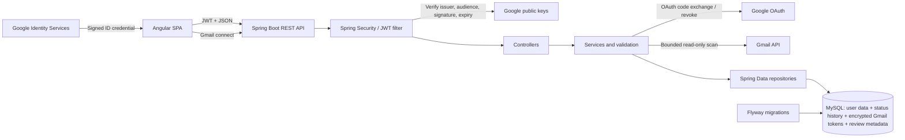

# JobTrackr

[](https://github.com/NeelLogic/JobTrackr/actions/workflows/ci.yml)

JobTrackr is a full-stack job application tracker for students and new graduates. It provides a secure, user-specific workspace for organizing opportunities, following application progress, and understanding job-search activity.

**Live demo:** [jobtrackr-neellogic.onrender.com](https://jobtrackr-neellogic.onrender.com)

> **Project status:** The public V1 deployment is live on Render with an external Aiven MySQL database, and Phase 12 final QA is in progress. Google Sign-In is available in the hosted demo, while restricted-scope Gmail import remains an optional self-hosted feature. The complete application also runs locally as production-style Docker containers with Nginx, Spring Boot, and persistent MySQL. Gemini-assisted workflows remain deferred to V2.

## Features

- Account registration and login with BCrypt password hashing and JWT authentication
- Google Sign-In for new or previously linked accounts
- Protected account settings for safely linking an existing password account to Google
- Gmail OAuth connection management with read-only permission, encrypted token storage, and disconnect controls
- On-demand Gmail scanning for Workday and common application confirmation or status emails
- A private review queue where detected fields can be corrected before an application is created
- User-bound message fingerprints that prevent repeat imports without storing raw Gmail message IDs or bodies
- Protected Angular routes and authenticated API requests
- User-specific data isolation at the repository and service layers
- Complete job application create, read, update, and confirmed-delete workflows across the dashboard, list, detail, and edit screens
- Company, job title, location, job URL, dates, employment type, salary, notes, and follow-up tracking
- Saved, Applied, Assessment, Interview, Offer, Rejected, and Withdrawn statuses
- Search by company, job title, or location
- Status and employment-type filters
- Server-side sorting and pagination
- Dashboard totals, active-pipeline metrics, response and offer rates, follow-up alerts, status distribution, and recent applications
- Date-range analytics for 30 days, 90 days, six months, or all recorded activity
- Application trends, stage funnel conversion, status mix, employment-type mix, and top companies
- Company-level totals, active applications, interviews reached, offers reached, search, and sorting
- Overdue, due-today, upcoming, and stale application follow-up queues
- Application status history recorded for every new application and subsequent status transition
- Sectioned workspace navigation for overview, tracking, integrations, and account management
- Responsive layouts, keyboard navigation, accessible form errors, and loading, empty, and error states
- Multi-stage production containers with a non-root backend runtime and health checks
- Docker Compose orchestration with private networking and persistent MySQL storage
- Free Render Blueprint configuration with checks-gated deployments, Aiven MySQL, and environment-managed secrets

## Tech Stack

| Layer          | Technologies                                                                |
| -------------- | --------------------------------------------------------------------------- |
| Frontend       | Angular 21, TypeScript 5.9, RxJS, SCSS                                      |
| Backend        | Java 21, Spring Boot 3.5, Spring Security, Spring Data JPA, Bean Validation |
| Database       | MySQL, Flyway migrations; H2 for automated tests                            |
| Authentication | BCrypt, Google Identity Services, OAuth 2.0, JWT, AES-256-GCM token storage |
| Testing        | JUnit 5, Spring Boot Test, Spring Security Test, Vitest                     |
| Tooling        | Maven Wrapper, npm, Git, GitHub Actions, Docker Compose                     |
| Deployment     | Docker, Nginx, Render Blueprint, Aiven MySQL                                |

## Architecture



The backend uses a controller-service-repository structure with DTOs, entity mapping, validation, and centralized exception handling. Application, status-history, analytics, company, follow-up, Gmail-connection, and Gmail-candidate queries are scoped to the authenticated user.

## Repository Structure

```text
JobTrackr/
|-- Backend/jobtrackr/       Spring Boot API, migrations, and tests
|-- Frontend/                Angular application and component tests
|-- Docs/                    Architecture, deployment, security, and integration guides
|-- .github/workflows/       Continuous integration
|-- .env.example             Safe local environment-variable template
|-- compose.yaml             Local full-stack container orchestration
|-- render.yaml              Render infrastructure blueprint
`-- README.md
```

## API Overview

| Method   | Endpoint                                         | Purpose                                             |
| -------- | ------------------------------------------------ | --------------------------------------------------- |
| `POST`   | `/api/auth/register`                             | Create a password account                           |
| `POST`   | `/api/auth/login`                                | Authenticate with a password and receive a JWT      |
| `GET`    | `/api/auth/google/config`                        | Retrieve the public Google client configuration     |
| `POST`   | `/api/auth/google`                               | Authenticate with a verified Google ID credential   |
| `POST`   | `/api/auth/google/link`                          | Link Google to the authenticated user's account     |
| `GET`    | `/api/auth/identities`                           | List the authenticated user's connected identities  |
| `GET`    | `/api/integrations/gmail`                        | Get the current user's Gmail connection status      |
| `POST`   | `/api/integrations/gmail/connect`                | Start Gmail OAuth with a one-time state             |
| `GET`    | `/api/integrations/gmail/callback`               | Complete Google's OAuth redirect                    |
| `DELETE` | `/api/integrations/gmail`                        | Disconnect Gmail and remove stored credentials      |
| `POST`   | `/api/integrations/gmail/scan`                   | Scan a bounded recent Gmail window on demand        |
| `GET`    | `/api/integrations/gmail/candidates`             | List the current user's pending suggestions         |
| `POST`   | `/api/integrations/gmail/candidates/{id}/import` | Import reviewed application data                    |
| `DELETE` | `/api/integrations/gmail/candidates/{id}`        | Dismiss an owned suggestion permanently             |
| `GET`    | `/api/applications`                              | Search, filter, sort, and paginate applications     |
| `POST`   | `/api/applications`                              | Create an application                               |
| `GET`    | `/api/applications/{id}`                         | View an owned application                           |
| `PUT`    | `/api/applications/{id}`                         | Update an owned application                         |
| `DELETE` | `/api/applications/{id}`                         | Delete an owned application                         |
| `GET`    | `/api/dashboard`                                 | Retrieve user-specific summary and action metrics   |
| `GET`    | `/api/analytics`                                 | Retrieve date-range trends and funnel analytics     |
| `GET`    | `/api/companies`                                 | Retrieve searchable company-level insights          |
| `GET`    | `/api/follow-ups`                                | Retrieve overdue, upcoming, and stale action queues |
| `GET`    | `/api/health`                                    | Check API health                                    |

Registration, password login, Google login, Google configuration, the one-time Gmail OAuth callback, and health checks are public. Starting or removing a Gmail connection, scanning Gmail, reviewing import candidates, account linking, connected identities, application data, dashboard metrics, analytics, company insights, and follow-up queues require an `Authorization: Bearer <token>` header.

### Analytics behavior

The Analytics screen can compare the last 30 days, 90 days, six months, or all recorded activity. Funnel metrics use application status history so an application remains counted as having reached Interview or Offer after it later moves to another status. Follow-up queues treat Applied, Assessment, Interview, and Offer as active stages; “stale” means an active application has not changed for at least 14 days.

Migration V5 creates a baseline history entry for applications that existed before Phase 10. Because earlier transitions were not available to backfill, historical stage accuracy for those records is limited to what can be inferred from their current status. Every transition made after V5 is recorded exactly.

## Local Development

### Prerequisites

- Java 21 or newer
- Node.js 22 and npm 10
- MySQL 8
- Docker Desktop with Docker Compose for the container workflow

### 1. Start MySQL

Make sure MySQL is running and that the configured user can create or access `jobtrackr_db`. Flyway creates and validates the application tables automatically.

### 2. Run the backend

From PowerShell:

```powershell
cd Backend\jobtrackr

$env:DB_USERNAME = "root"
$env:DB_PASSWORD = "your-mysql-password"
$env:JWT_SECRET = "replace-with-a-random-secret-of-at-least-32-characters"
$env:GOOGLE_CLIENT_ID = "your-client-id.apps.googleusercontent.com"

.\mvnw.cmd spring-boot:run
```

The API runs at `http://localhost:8080`. Verify it with `http://localhost:8080/api/health`.

### 3. Run the frontend

In a second terminal:

```powershell
cd Frontend
npm ci
npm start
```

Open `http://localhost:4200`. The Angular development proxy forwards `/api` requests to the backend.

### Run both applications with one command

Copy `.env.example` to `.env`, replace every placeholder needed for your local
setup, and keep `.env` out of Git. Then run:

```powershell
cd Frontend
npm ci
npm run dev
```

The `dev` command loads the repository-root `.env` file and starts both Spring
Boot and Angular. Use the separate commands above when you need to restart or
debug one process independently.

### Run the production-style Docker stack

Copy the safe environment template once and replace the local placeholders:

```powershell
Copy-Item .env.example .env
docker compose up --build
```

Open `http://localhost:4200`. Nginx serves the Angular production build and
proxies `/api` to the private backend container. The backend waits for MySQL to
be healthy, Flyway applies the schema, and database data persists in the named
`jobtrackr_mysql_data` volume.

Stop the services without deleting data:

```powershell
docker compose down
```

Delete the local Docker database only when you intentionally want a clean
environment:

```powershell
docker compose down --volumes
```

This volume is separate from a MySQL installation running directly on Windows.

### Google Sign-In setup

Google Sign-In is disabled automatically when `GOOGLE_CLIENT_ID` is not configured, so local password authentication continues to work without Google.

The public Render deployment uses its own production Google Sign-In client ID,
so visitors can sign in with their Google account without providing keys.

To enable it:

1. Open Google Cloud Console and select or create a project.
2. In Google Auth Platform, configure the app for an external testing audience and add your Google account as a test user.
3. Create an OAuth client with application type **Web application**.
4. Add `http://localhost` and `http://localhost:4200` as authorized JavaScript origins.
5. Copy the public client ID into `GOOGLE_CLIENT_ID`, then restart the backend.

Phase 7 uses the Google Identity Services callback flow and does not require a redirect URI or client secret. Never add a Google client secret to the frontend or repository.

### Gmail connection setup

Phase 9 uses the Phase 8 authorization to run a bounded, on-demand scan of recent application-related messages. Every detected item stays in a private review queue until the user edits and explicitly approves it. JobTrackr does not store raw Gmail message IDs or message bodies.

Gmail import is not enabled on the public V1 deployment because
`gmail.readonly` is a restricted scope. When its backend credentials are absent,
the Angular sidebar, import page, and Settings clearly identify Gmail as a
self-hosted feature and link to
[the complete Google integration guide](Docs/GOOGLE_INTEGRATION.md). The
password, Google Sign-In, manual tracking, dashboard, and analytics features
remain available.

1. In the same Google Cloud project, enable the **Gmail API**.
2. Keep the OAuth audience in **Testing** and add your Google account as a test user.
3. Add the restricted scope `https://www.googleapis.com/auth/gmail.readonly` under **Data access**.
4. Create a **Web application** OAuth client for the Gmail server flow, or add the redirect URI to an existing web client.
5. Add this exact authorized redirect URI:

   ```text
   http://localhost:8080/api/integrations/gmail/callback
   ```

6. Generate a 32-byte token-encryption key:

   ```powershell
   $gmailKeyBytes = New-Object byte[] 32
   $gmailRng = [Security.Cryptography.RandomNumberGenerator]::Create()
   $gmailRng.GetBytes($gmailKeyBytes)
   $gmailRng.Dispose()
   [Convert]::ToBase64String($gmailKeyBytes)
   ```

7. Set the Gmail client ID, client secret, and generated key before starting the backend:

   ```powershell
   $env:GOOGLE_GMAIL_CLIENT_ID = "your-gmail-client-id.apps.googleusercontent.com"
   $env:GOOGLE_GMAIL_CLIENT_SECRET = "your-google-client-secret"
   $env:GMAIL_TOKEN_ENCRYPTION_KEY = "the-generated-base64-value"
   ```

8. Restart the backend, sign in to JobTrackr, open **Settings**, and select **Connect Gmail**.
9. Open **Gmail import**, select **Scan Gmail**, review each suggestion, and explicitly import or dismiss it.

Never put the client secret or encryption key in Angular, Git, screenshots, or documentation. Google OAuth apps left in Testing may issue refresh tokens that expire after seven days, so reconnecting during local development is expected.

The default scan examines at most 100 matching messages from the previous 180 days. Scans are user initiated; no Gmail push notifications, background mailbox monitoring, Workday credentials, or Workday private API are used.

## Environment Variables

| Variable                      | Required              | Default                          | Description                                                   |
| ----------------------------- | --------------------- | -------------------------------- | ------------------------------------------------------------- |
| `DB_URL`                      | No                    | Local MySQL `jobtrackr_db` URL   | JDBC URL; hosted Aiven connections must require TLS           |
| `DB_USERNAME`                 | No                    | `jobtrackr`                      | Database username                                             |
| `DB_PASSWORD`                 | Yes                   | None                             | Database password                                             |
| `DB_POOL_SIZE`                | No                    | `10`                             | Maximum connection-pool size                                  |
| `PORT`                        | No                    | `8080`                           | Backend HTTP port; Render supplies its service port           |
| `JWT_SECRET`                  | Yes                   | None                             | JWT signing secret; use at least 32 random characters         |
| `JWT_EXPIRATION_MS`           | No                    | `86400000`                       | Token lifetime in milliseconds                                |
| `CORS_ALLOWED_ORIGINS`        | No                    | `http://localhost:4200`          | Comma-separated allowed frontend origins                      |
| `GOOGLE_CLIENT_ID`            | No                    | Empty                            | Public client ID that enables Google Sign-In                  |
| `GOOGLE_GMAIL_CLIENT_ID`      | For Gmail integration | Empty                            | OAuth web-client ID for the Gmail server flow                 |
| `GOOGLE_GMAIL_CLIENT_SECRET`  | For Gmail integration | Empty                            | OAuth client secret; backend only                             |
| `GMAIL_TOKEN_ENCRYPTION_KEY`  | For Gmail integration | Empty                            | Base64-encoded 32-byte key for AES-256-GCM token encryption   |
| `GOOGLE_GMAIL_REDIRECT_URI`   | No                    | Local backend Gmail callback     | Must exactly match the Google OAuth client redirect URI       |
| `GMAIL_FRONTEND_CALLBACK_URL` | No                    | `http://localhost:4200/settings` | Fixed frontend destination after the OAuth callback           |
| `GMAIL_OAUTH_STATE_TTL`       | No                    | `10m`                            | Lifetime of a single-use Gmail OAuth state                    |
| `GMAIL_IMPORT_LOOKBACK_DAYS`  | No                    | `180`                            | Recent Gmail window; backend limits the value to 1–365 days   |
| `GMAIL_IMPORT_MAX_MESSAGES`   | No                    | `100`                            | Maximum messages per scan; backend limits the value to 1–100  |
| `JOBTRACKR_API_URL`           | Frontend build        | `/api`                           | Public API base URL embedded in the generated frontend config |
| `DOCKER_DB_PASSWORD`          | Docker only           | Local development value          | Non-root MySQL password used by Docker Compose                |
| `DOCKER_DB_ROOT_PASSWORD`     | Docker only           | Local development value          | MySQL root password used only by the local container          |

Never commit real credentials or production secrets. Configure them through local environment variables and, for deployment, the Render environment settings. Aiven connection values belong only in Render's secret settings. The Google client ID is public configuration, but it remains environment-specific and is not hard-coded into the Angular application.

## Testing

Run the backend test suite and production package:

```powershell
cd Backend\jobtrackr
.\mvnw.cmd --batch-mode --no-transfer-progress verify
```

Run the frontend tests and production build:

```powershell
cd Frontend
npm run config:check
npm test -- --watch=false
npm run build
```

Current Phase 12 baseline:

- 58 backend tests covering password and Google authentication, Gmail configuration, token encryption, single-use OAuth callbacks, Gmail query encoding, email parsing, deduplication, reviewed imports, status history, analytics calculations, follow-up classification, authorization, validation, user data isolation, services, JWT behavior, and API integration
- 87 frontend tests covering API services, route guards, password and Google authentication, Gmail availability and connection settings, Gmail scanning and review, advanced analytics, companies, follow-ups, dashboard, confirmed application deletion, application workflows, and navigation
- 5 Node tests covering safe frontend runtime API configuration, JavaScript-string escaping, and free Render Blueprint constraints
- Local container verification covering image builds, health checks, Flyway migrations, Nginx proxying, Angular deep links, and MySQL persistence across a full restart

## Continuous Integration

GitHub Actions runs on every pull request to `main` and every push to `main`:

- Backend tests and executable JAR build
- Frontend formatting, runtime-config validation, tests, and production build
- Docker Compose validation and backend/frontend image builds
- Pull-request dependency security review

Merges should only proceed after all required checks pass.

## Security

- Passwords are hashed with BCrypt and never returned by the API
- Google ID credentials are verified server-side for signature, issuer, audience, expiry, subject, and verified email
- Google credentials are exchanged for a JobTrackr JWT and are never stored
- Existing password accounts are never linked automatically by matching email; the user must first authenticate and link Google from Settings
- External provider subjects and user-provider pairs are protected by database uniqueness constraints
- Gmail OAuth state values are random, stored only as SHA-256 hashes, expire quickly, and can be consumed only once
- Gmail access and refresh tokens are encrypted with AES-256-GCM and bound to the owning user before database storage
- A connected Gmail address must match the authenticated JobTrackr account, and connection data is always queried by user ID
- Gmail uses read-only permission (`gmail.readonly`) and scans only when the authenticated user requests it
- Gmail scans are bounded by age and message count; raw message bodies and raw Gmail message IDs are not stored
- Import candidates use SHA-256 user-bound message fingerprints for deduplication and are always queried by owner
- No application is created from Gmail until the owner reviews validated fields and explicitly approves the import
- Status history, analytics, company insights, and follow-up queues are always loaded by authenticated user ID
- The API is stateless and validates signed JWTs on protected endpoints
- CORS origins are environment-configurable
- Request DTOs enforce field, date, URL, currency, and salary validation
- Centralized error responses omit stack traces and internal details
- Application access is always scoped to the authenticated user
- GitHub secret scanning, push protection, dependency graph, and dependency review are enabled

For a future production hardening pass, token storage can move from browser local storage to short-lived access tokens with secure, HTTP-only refresh cookies.

## Project Phases

| Phase | Scope                                                              | Status        |
| ----- | ------------------------------------------------------------------ | ------------- |
| 1     | Repository foundation and planning                                 | Complete      |
| 2     | Backend architecture and authentication                            | Complete      |
| 3     | Application management, validation, and data isolation             | Complete      |
| 4     | Dashboard analytics and query capabilities                         | Complete      |
| 5     | Angular frontend and API integration                               | Complete      |
| 6     | Frontend testing, accessibility, responsive polish, and CI gates   | Complete      |
| 7     | Google Sign-In and secure account linking                          | Complete      |
| 8     | Gmail connection and permission management                         | Complete      |
| 9     | Workday-email detection, import review, and deduplication          | Complete      |
| 10    | Advanced company and application analytics                         | Complete      |
| 11    | Gemini-assisted resume and cover-letter workflows                  | Deferred (V2) |
| 12    | Docker, Render deployment, final QA, documentation, and V1 release | In progress   |

### Phase Closeout Checklist

Every phase is complete only after:

- Relevant tests and production builds pass
- Security and repository-cleanliness checks pass
- The README reflects the features, setup, test counts, deployment state, and next phase
- A focused pull request passes all required GitHub checks

## Planned Improvements

The following improvements are outside the V1.0 release scope and are candidates for V2:

- Broader provider-specific email detection rules based on real-world opt-in feedback
- Gemini-assisted resume and cover-letter generation with user review
- Exportable analytics and configurable follow-up reminder windows
- End-to-end browser tests for production-critical workflows
- Optional refresh-token rotation and password-reset workflow
